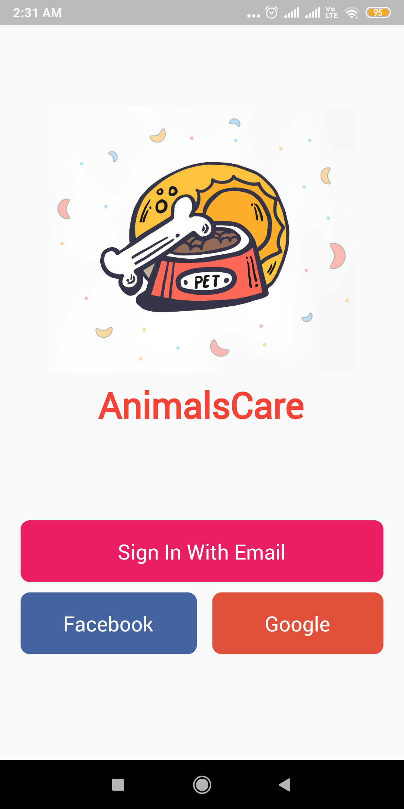
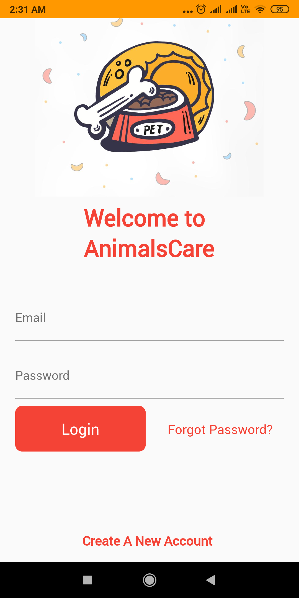
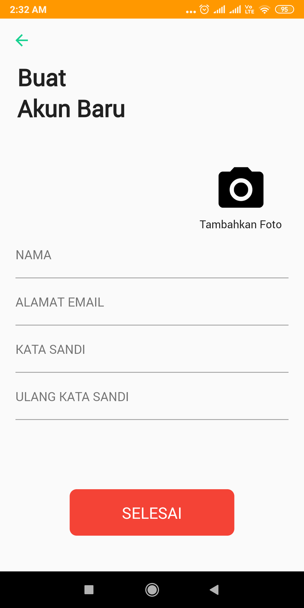
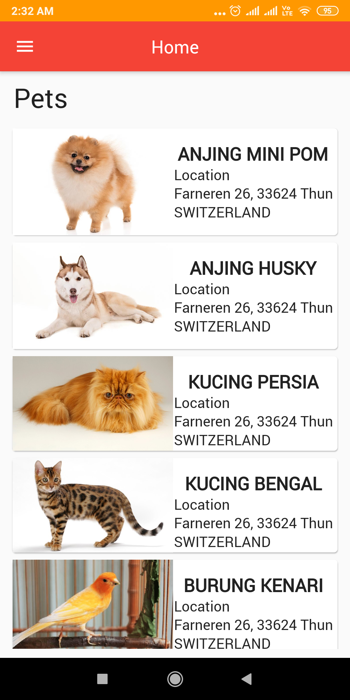
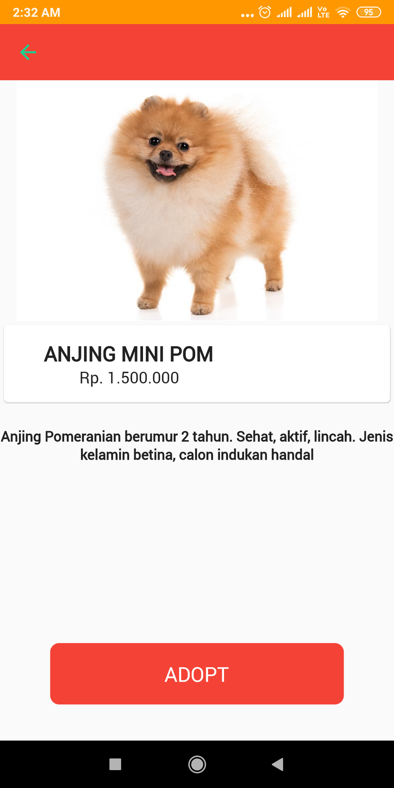
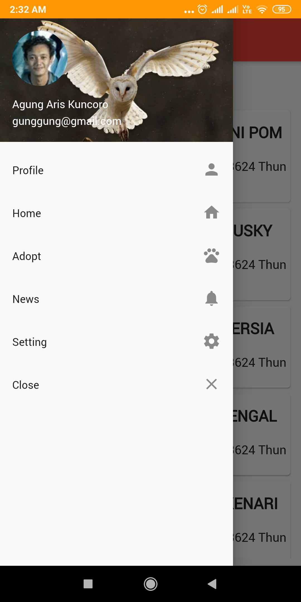
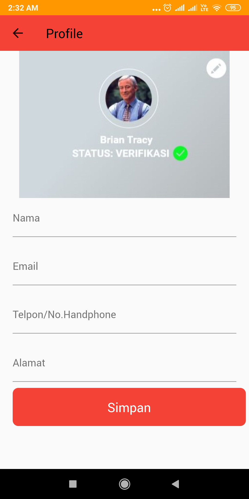
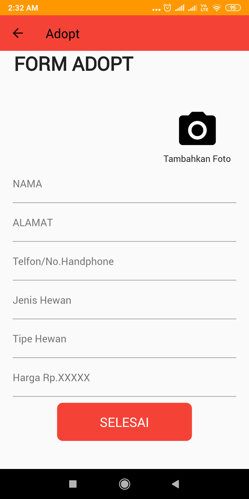
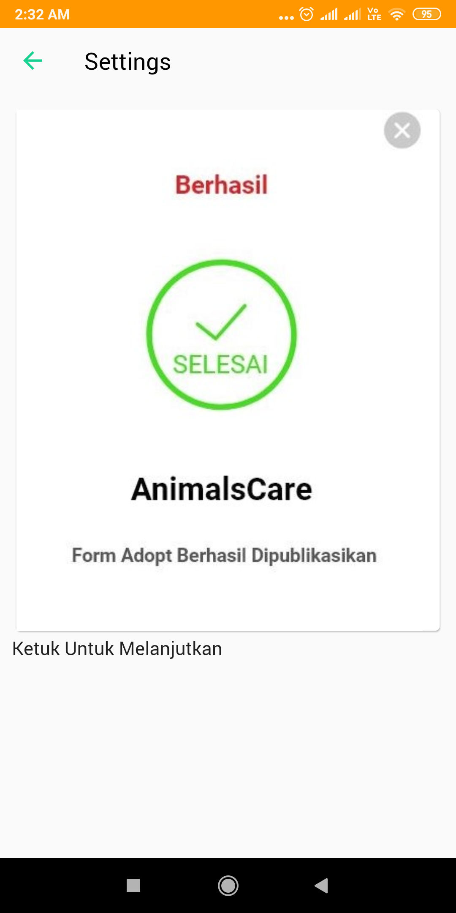
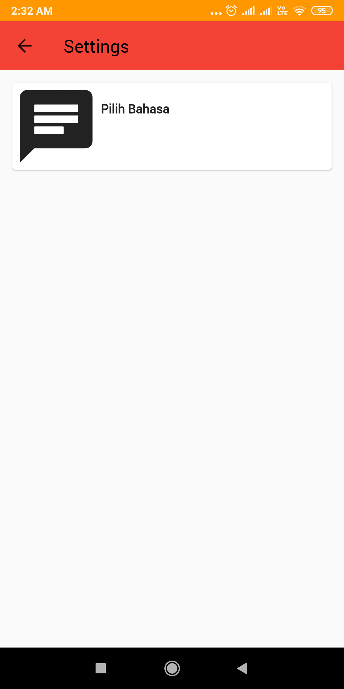

# AnimalsCare (Project UTS)
Note : File lengkap dapat di download via google drive https://drive.google.com/open?id=1d4i2aPSlfo_l-Ws-b8iBEiAz1NjycRtm . Terima kasih.
  Kelompok :
 - Heven (20175520002) 
 - Vikrie Alfiansyah (20175520005) 
 - Yeni Kurniawati (20175520013) 

## Judul : AnimalsCare 

## Deskripsi : 
App Mobile yang bertujuan untuk pemilik hewan yang ingin diadopsi & untuk orang yang ingin mengadopsi hewan. App ini memudahkan untuk pemilik hewan maupun pecinta hewan untuk menemukan hewan yang diinginkan. 

## Screenshots :
## 1. Tampilan Awal                                  

## 2. Tampilan Login                                  

## 3. Tampilan Sign Up                                  

## 4. Tampilan Home                                  

## 5. Tampilan Detail                                  

## 6. Tampilan Menu Side Bar                                  

## 7. Tampilan Profile                                  

## 8. Tampilan Form Adopt                                  

## 9. Tampilan Sukses Daftar Adopt                                 

## 10. Tampilan Setting                                  

## Built With :
- Row
- Column
- Image
- Card
- Appbar
- Sidebar
- Button
- Navigator
- Inputtext
- Textfield

## Created By :
1. Heven
  - main.dart
  - home.dart
  - dog.dart
  - myaccount.dart
  
2. Vikrie Alfiansyah
  - detail.dart
  - daftar.dart
  - setting.dart
  - pilihbahasa.dart
  
3. Yeni Kurniawati
  - login.dart
  - adopt.dart
  - selesai.dart
  
